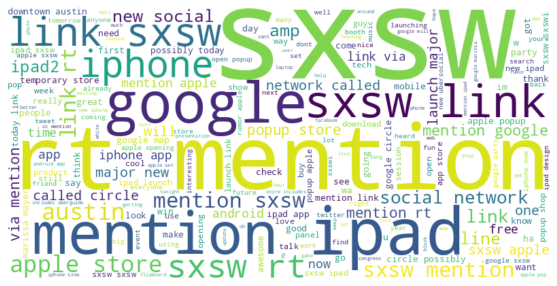

 #### NLP ANALYSIS ON TWITTER FEEDBACK ON APPLE AND GOOGLE PRODUCTS
 

### Project Overview
This project aims to develop a classifier that predicts the sentimen t of tweets related to topics or brands, categorizing them into positive, negative, or neutral sentiments. Given the informal nature of Twitter data, which often includes slang, abbreviations, and diverse linguistic expressions, creating a reliable sentiment analysis model presents a complex challenge.

The target audience for this classifier includes companies like Apple and Google, which seek to gain deeper insights into consumer interactions with their products and brands. By accurately classifying tweet sentiments, these companies can better understand public perception, identify emerging trends, and respond to consumer feedback effectively

### Problem Statement

Accurately classifying the sentiments expressed in tweets about topics or brands into specific classes- positive, negative or neutral is a huge challenge for companies like Apple and Google. Given the diverse nature of informal data, with its use of slang, abbreviations, coming up with a reliable sentiment analysis model that can effectively interpret and classify the tweets can be a complex task. Getting this task right provides a wide variety of novel information for a company like Apple by providing insights and creating better understanding overall of how consumers interact with products/brands.

### Objective 

The main objective is to build a model that can rate the sentiment of a tweet based on its content.

### Data Understanding

The dataset that will be used in this study comes from CrowdFlower via data.world through this link - https://data.world/crowdflower/brands-and-product-emotions.
It contains tweet reviews of apple and google products.

### Data Preprocessing

The data preprocessing process included removing whitespaces, removing uppercase characters, removing special characters and punctuation marks.It also included tokenization, stemming and lemmatization.

### Modeling and Evaluation

We tested various models. They included logistec regression, naive bayes regression and decision trees.
We also included deep learning models, CNN and GRU.
We settled on SVM which a training and testing accuracy of 89% and 71 % respectively.

### Limitations

- The model struggled to classify positive sentiment tweets as compared to other classes.
- Identifying slang words and urban abbreviations to include in sentiment analysis. This will help to incorporate different generations especially the Gen Z and Gen Aplha who heavily use twitter.
- Overfitting of our data.

### Next Steps

- Incorporate slang words and urban abbreviations to include to improve sentiment analysis.
- Implement real-time sentiment monitoring for Twitter to detect shifts in public sentiment.
- Regularly assessing the performance of our recommended model, incorporate new data as it becomes accessible, and fine-tune it in response to evolving business requirements and customer behaviors.

